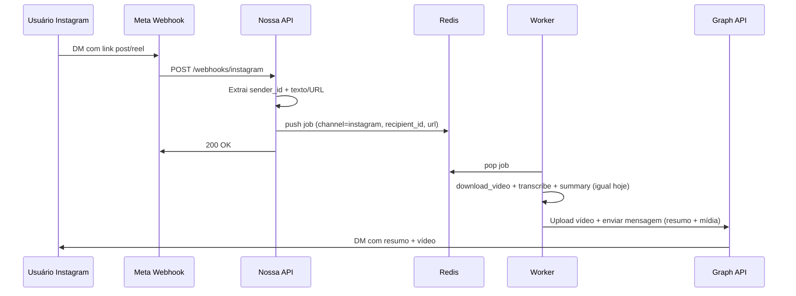

# Bot no Instagram Direct (mídia + resumo)

## Objetivo

Criar uma **página no Instagram** (conta Professional) que funcione como bot: o usuário envia um link de post/reel pelo Direct e recebe de volta o **vídeo (ou GIF)** e o **resumo** na mesma conversa, como já acontece no Telegram.

## Pré-requisitos (fora do código)

- **Conta Instagram Professional** (Business ou Creator).
- **Página do Facebook** vinculada à conta Instagram (ou uso do fluxo “Instagram Login” mais recente, conforme [Getting Started](https://developers.facebook.com/docs/messenger-platform/instagram/get-started/)).
- **App no Meta for Developers** com produto “Messenger” / “Instagram Messaging” e permissões:
  - `instagram_basic`, `instagram_manage_messages`, `pages_manage_metadata`
  - Para receber webhooks de qualquer usuário: **Advanced Access** (App Review).
- **Webhook em HTTPS**: URL pública para o Meta enviar eventos (ex.: `https://seu-dominio.com/webhooks/instagram`).
- **Variáveis de ambiente**: `INSTAGRAM_PAGE_ID`, `INSTAGRAM_PAGE_ACCESS_TOKEN` (Page Access Token com permissão de mensagens).

Limitações importantes da API:

- Resposta apenas na **janela de 24h** após o usuário enviar a primeira mensagem.
- Vídeo enviado no Direct: **máx. 25 MB** (no Telegram o limite é 50 MB).
- Produção além de usuários de teste exige **App Review** das permissões.

## Arquitetura proposta

- **Canal único de processamento**: a fila Redis passa a aceitar jobs com `channel`: `"telegram"` ou `"instagram"`. O worker atual em [src/queue.py](src/queue.py) continua fazendo download, transcrição e resumo; só muda o “envio” conforme o canal.
- **Recebimento Instagram**: endpoint HTTP (FastAPI) que recebe o webhook do Meta, valida (GET verification), parseia mensagens e compartilhamentos, extrai link de post/reel e enfileira job com `channel: "instagram"`, `recipient_id` (IGSID), `page_id` e token (ou token global no env).

## Implementação

### 1. Webhook Instagram (receber DMs)

- **Servidor HTTP**: o projeto já usa [FastAPI](https://fastapi.tiangolo.com/) em `requirements.txt`. Subir um app FastAPI (ou integrar ao mesmo processo do bot Telegram) com rota **GET** e **POST** para o webhook (ex.: `/webhooks/instagram`).
- **Verificação (GET)**: Meta envia `hub.mode`, `hub.verify_token`, `hub.challenge`. Comparar `hub.verify_token` com um valor fixo em env (ex.: `INSTAGRAM_VERIFY_TOKEN`); responder com `hub.challenge` em texto.
- **Eventos (POST)**: body JSON com `object: "instagram"` e `entry[].messaging[]`. Para cada item:
  - **Texto**: `message.text` pode conter link; extrair com a mesma lógica de [src/downloader.py](src/downloader.py) (`extract_instagram_urls` / `is_instagram_link`).
  - **Compartilhamento de post**: “Only the URL for the shared media or post is included” — usar o URL do attachment quando `message.attachments[].type` for `share` (e payload com URL).
  - Ignorar `is_echo: true` (mensagens enviadas pelo próprio bot).
  - Obter `sender.id` (IGSID) e, se houver URL de post/reel, chamar lógica de limite (por exemplo por `recipient_id`/dia, similar ao Telegram) e `push_job` com payload incluindo `channel: "instagram"`, `recipient_id`, `url`, e identificador da “conversa” se necessário (e.g. `page_id`).
- **Resposta rápida**: responder 200 OK logo após enfileirar (não esperar o processamento). Opcional: enviar “typing” ou mensagem de texto “Na fila. Baixando em breve...” via Graph API para dar feedback imediato (usa o mesmo token e `recipient_id`).

Arquivo sugerido: novo módulo `src/instagram_webhook.py` (rotas FastAPI + parsing do payload) e registro da rota no ponto de entrada do servidor HTTP (ou em [src/main.py](src/main.py) se o HTTP for iniciado no mesmo processo).

### 2. Fila e worker: canal Instagram

- **Payload do job**: estender o formato em [src/queue.py](src/queue.py) para incluir:
  - `channel`: `"telegram"` (default) ou `"instagram"`.
  - Para Instagram: `recipient_id` (IGSID), e opcionalmente `page_id` (se múltiplas páginas). Token pode vir de env (`INSTAGRAM_PAGE_ACCESS_TOKEN`) para uma única página.
- `**push_job`**: em `handlers.py` continua enviando só Telegram. No webhook Instagram, após parsear a mensagem, chamar algo como `push_job(redis, ..., url, channel="instagram", recipient_id=..., page_id=...)` (assinatura a definir para não quebrar chamadas atuais).
- **Worker `_process_job`**: se `channel == "instagram"`:
  - Não usar `chat_id` nem `status_message_id` do Telegram.
  - (Opcional) Enviar mensagem de status no Direct via Graph API (ex.: “Transcrevendo e gerando resumo...” / “Enviando...”).
  - Após obter `video_path` e `caption` (resumo), enviar no Instagram:
    - **Vídeo**: API de envio de mídia (Attachment Upload). Endpoint: `POST /{PAGE_ID}/message_attachments` com multipart (tipo `video`, arquivo local). Depois `POST /me/messages` com `recipient.id` e `message.attachment` usando o `attachment_id` retornado (ou equivalente). Limite **25 MB**; se o arquivo for maior, usar a mesma estratégia do Telegram: converter para GIF (e enviar como animação se a API suportar) ou enviar só o resumo + texto informando que o vídeo é grande (e eventualmente link se houver hospedagem).
  - Enviar **resumo** como texto no Direct (pode ser em mensagem separada antes do vídeo, ou como “caption” se a API de envio de mídia no Instagram suportar texto junto ao anexo; documentação indica mensagem com attachment e possivelmente texto em outra mensagem).
  - Limite diário: aplicar lógica análoga a `can_download_today` por `recipient_id` (chave Redis por dia), para não exceder N downloads por dia por usuário no Instagram.
- **Telegram**: manter comportamento atual quando `channel` for `"telegram"` ou ausente.

### 3. Envio de mídia no Instagram (Graph API)

- **Token e endpoint**: usar `INSTAGRAM_PAGE_ACCESS_TOKEN` e `INSTAGRAM_PAGE_ID`. Endpoint base: `https://graph.facebook.com/v21.0/` (ou versão estável mais recente).
- **Upload de vídeo**: `POST /{PAGE_ID}/message_attachments` com `multipart/form-data`: `message.attachment.type=video`, `filedata=@arquivo.mp4`. Resposta com ID do attachment.
- **Enviar mensagem com vídeo**: `POST /me/messages?access_token=...` com body JSON: `recipient: { id: IGSID }`, `message: { attachment: { type: "video", payload: { attachment_id: "..." } } }`. Se a API permitir texto junto ao attachment na mesma mensagem, usar o resumo; senão, enviar primeiro uma mensagem só de texto (resumo) e em seguida a mensagem com o vídeo.
- **Vídeo > 25 MB**: reutilizar [src/video_utils.py](src/video_utils.py) `video_to_gif` e enviar como imagem/GIF se o tamanho ficar dentro do limite; caso contrário, enviar apenas o resumo e avisar que o vídeo é grande.

### 4. Configuração e deploy

- **Variáveis de ambiente** (ex.: `.env.example` e documentação):
  - `INSTAGRAM_PAGE_ID` – ID da página Facebook ligada ao Instagram.
  - `INSTAGRAM_PAGE_ACCESS_TOKEN` – Page Access Token com permissão de mensagens.
  - `INSTAGRAM_VERIFY_TOKEN` – string que você define e configura no App do Meta no campo “Verify Token” do webhook.
- **Servidor**: o processo que hoje só roda o bot Telegram precisa também expor o FastAPI (ou outro) em HTTPS para o webhook. Em produção isso implica:
  - Um domínio com SSL (ex.: reverse proxy com Let’s Encrypt).
  - Configurar no App do Meta a URL do webhook e assinar o tópico “Instagram” (mensagens).
- **Documentação**: atualizar README com passos para criar a página Instagram, configurar o App, configurar o webhook e as env vars, e mencionar limite de 24h e 25 MB.

## Resumo dos arquivos

| Onde    | O que                                                                                                                                                                           |
| ------- | ------------------------------------------------------------------------------------------------------------------------------------------------------------------------------- |
| Novo    | `src/instagram_webhook.py` – rotas GET/POST do webhook, parsing, extração de URL e `push_job` para canal Instagram.                                                             |
| Novo    | `src/instagram_send.py` – funções para enviar mensagem de texto e upload + envio de vídeo/GIF via Graph API.                                                                    |
| Alterar | `src/queue.py` – payload com `channel`, `recipient_id` (e `page_id` se necessário); em `_process_job`, ramo para Instagram usando `instagram_send` e limite por `recipient_id`. |
| Alterar | Ponto de entrada (ex.: `src/main.py` ou script separado) – iniciar servidor HTTP (uvicorn) com o FastAPI que registra o blueprint/rotas do webhook.                             |
| Alterar | `.env.example` e README – variáveis Instagram e instruções de configuração do webhook e da página.                                                                              |

## Ordem sugerida

1. Definir formato do job na fila (campo `channel` + campos Instagram) e ajustar `push_job`.
2. Implementar `instagram_send.py` (envio de texto e de vídeo/GIF) e usar no worker quando `channel == "instagram"`.
3. Implementar `instagram_webhook.py` (verificação + parsing + enfileiramento) e servir via FastAPI.
4. Integrar o servidor HTTP ao startup do projeto e documentar configuração e limites (24h, 25 MB, App Review).

