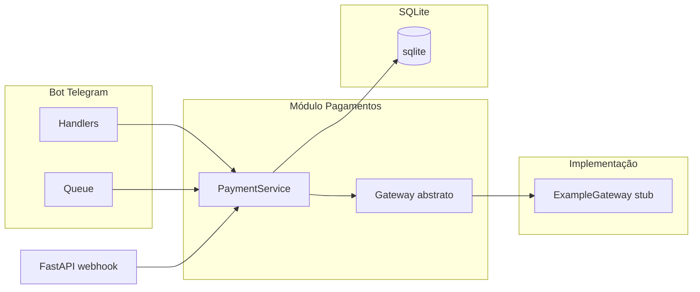

# Plano: Pagamentos PIX, planos e whitelist

## Contexto atual

- Bot Telegram (Instagram downloader) em `src/main.py`, handlers em `src/handlers.py`, fila em `src/queue.py`.
- Limite hoje: **10 downloads/dia** por `chat_id` em Redis (`src/queue.py` — `can_download_today`, `increment_daily_download_count`).
- Identidade: apenas `chat_id` / `effective_user.id` do Telegram; sem banco de dados.

## Arquitetura alvo

- **Limite**: substituir o limite fixo de 10/dia por **saldo de posts** no SQLite. Usuário na whitelist = sem checagem de saldo (ilimitado).
- **Sem recorrência**: cada compra via PIX adiciona N posts ao saldo do usuário (recarga avulsa).

---

## 1. Banco de dados (SQLite + SQLModel)

- **Driver**: SQLModel + engine SQLite (ex.: `sqlite:///./data/salvaai.db`), criando tabelas com `SQLModel.metadata.create_all(engine)` no startup (sem Alembic por enquanto).
- **Variável de ambiente**: `DATABASE_URL` ou `SQLITE_PATH` (ex.: `sqlite:///./data/salvaai.db`).

**Modelos sugeridos** (em `src/db/models.py` ou em `src/payments/models.py`):

| Modelo        | Uso                                                                                                                                                                                             |
| ------------- | ----------------------------------------------------------------------------------------------------------------------------------------------------------------------------------------------- |
| **User**      | `telegram_user_id` (int), `telegram_chat_id` (int), `balance_posts` (int, default 0), timestamps. Índice único em `telegram_user_id` (ou `telegram_chat_id` se for o identificador principal).  |
| **Plan**      | `id`, `slug` (basic/pro/creator), `name`, `price_cents` (int), `posts_included` (int). Dados fixos: Basic 1000/20, Pro 2500/60, Creator 4500/120.                                               |
| **Recharge**  | `id`, `user_id` (FK User), `plan_id` (FK Plan), `amount_cents`, `posts_granted`, `gateway`, `gateway_charge_id`, `status` (pending/paid/cancelled/expired), `created_at`, `paid_at` (nullable). |
| **Usage**     | (opcional) `id`, `user_id`, `used_at`, `token_cost_usd` (float) — histórico de consumo e custo de tokens em dólar por uso.                                                                      |
| **Whitelist** | `telegram_user_id` (int, único), `reason` (opcional), `created_at`.                                                                                                                             |

---

## 2. Módulo de pagamentos desacoplado (gateway)

- **Local**: `src/payments/`.
- **Escopo**: apenas **interface base** + **uma implementação de exemplo (stub)**. Não implementar gateway real (Mercado Pago, Asaas, etc.) neste momento.

**2.1 Interface do gateway (base)**

- Arquivo: `src/payments/gateway/base.py` (ou `protocol.py`).
- Classe abstrata ou `Protocol` com:
  - `create_pix_charge(amount_cents: int, reference: str, customer_identifier: str, ...) -> CreateChargeResult`
  - `get_charge_status(charge_id: str) -> ChargeStatus` (pending/paid/cancelled/expired)
- DTOs: `CreateChargeResult` (charge_id, qr_code ou link, qr_code_base64 se aplicável, expires_at); `ChargeStatus` (status, paid_at opcional).

**2.2 Implementação de exemplo (stub)**

- Arquivo: `src/payments/gateway/example.py` (ou `stub.py`).
- Implementação que satisfaz a interface base mas **não chama nenhuma API externa**:
  - `create_pix_charge`: retorna dados fictícios (ex.: charge_id = "example-{uuid}", qr_code/link placeholder, expires_at daqui a 30 min).
  - `get_charge_status`: retorna sempre `pending` (ou permitir simular "pago" por charge_id especial, ex. para testes).
- Objetivo: permitir desenvolver e testar o fluxo do bot (comprar, webhook, saldo) sem integração real; no futuro troca-se por uma implementação real (Mercado Pago, etc.) sem alterar o resto do código.

**2.3 Factory**

- `src/payments/gateway/factory.py`: retorna a implementação **example** (única por enquanto). Pode ler algo como `PAYMENT_GATEWAY=example` para manter o padrão desacoplado.

**2.4 Serviço de domínio (PaymentService)**

- `src/payments/service.py`: mesma lógica descrita antes (get_or_create_user, is_whitelisted, get_plans, create_recharge, confirm_recharge, can_download, consume_post), usando o gateway injetado (base + example).

---

## 3. Webhook HTTP (FastAPI)

- App FastAPI com endpoint POST (ex.: `/payments/webhook`) que recebe payload, identifica `charge_id`, chama `PaymentService.confirm_recharge(gateway_charge_id)`.
- Para o **example gateway**, o webhook pode aceitar um body simples (ex.: `{"charge_id": "..."}`) e marcar como pago quando o stub assim indicar (ou um charge_id especial como `example-paid` para teste manual).

---

## 4. Integração no bot

- Inicialização: criar engine SQLite, popular Plan, injetar PaymentService (gateway = example) em `bot_data`.
- Comandos: `/planos`, `/comprar <slug>`.
- Em `handle_message`: permitir download se whitelist ou `can_download(telegram_user_id)`; no worker, após envio com sucesso, `consume_post(telegram_user_id)`.

---

## 5. Whitelist

- Tabela **Whitelist**; `PaymentService.is_whitelisted(telegram_user_id)`.
- Cadastro: env `TELEGRAM_WHITELIST_USER_IDS` (opcional) + comando `/whitelist add|remove <user_id>` restrito a `TELEGRAM_ALLOWED_USER_ID`.

---

## 6. Planos (valores fixos)

| Slug    | Nome    | Preço | Posts |
| ------- | ------- | ----- | ----- |
| basic   | Básico  | R$ 10 | 20    |
| pro     | Pro     | R$ 25 | 60    |
| creator | Creator | R$ 45 | 120   |

---

## 7. Variáveis de ambiente

- `DATABASE_URL` ou `SQLITE_PATH`: SQLite.
- `PAYMENT_GATEWAY=example` (opcional; default example).
- `TELEGRAM_WHITELIST_USER_IDS`: (opcional) IDs para whitelist.
- URL do webhook: ex. `WEBHOOK_BASE_URL` para montar o path (útil quando houver gateway real).

---

## 8. Ordem sugerida de implementação

1. SQLite + SQLModel (User, Plan, Recharge, Whitelist; opcional Usage).
2. Seed dos planos; PaymentService (usuário, whitelist, saldo).
3. Gateway: **base** (interface + DTOs) + **example** (stub); factory; integrar create_recharge/confirm_recharge no serviço.
4. FastAPI webhook (compatível com o formato do example para testes).
5. Handlers `/planos`, `/comprar` e fluxo de download (can_download + consume_post) e worker.
6. Whitelist (env + comando `/whitelist`).

---

## Resumo: gateway

- **Fazer**: interface base (base.py) + uma implementação de **exemplo/stub** (example.py) que não depende de API externa.
- **Não fazer neste escopo**: integração real com Mercado Pago ou outro provedor; isso pode ser adicionado depois como outra implementação da mesma interface.

